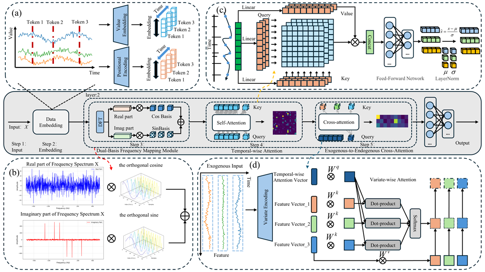
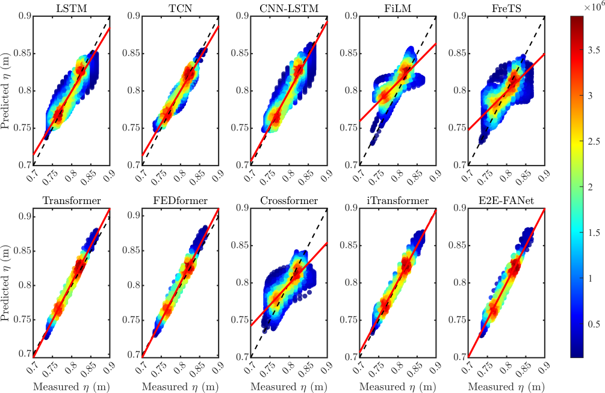
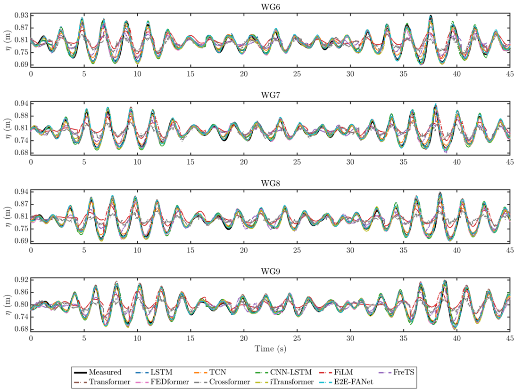
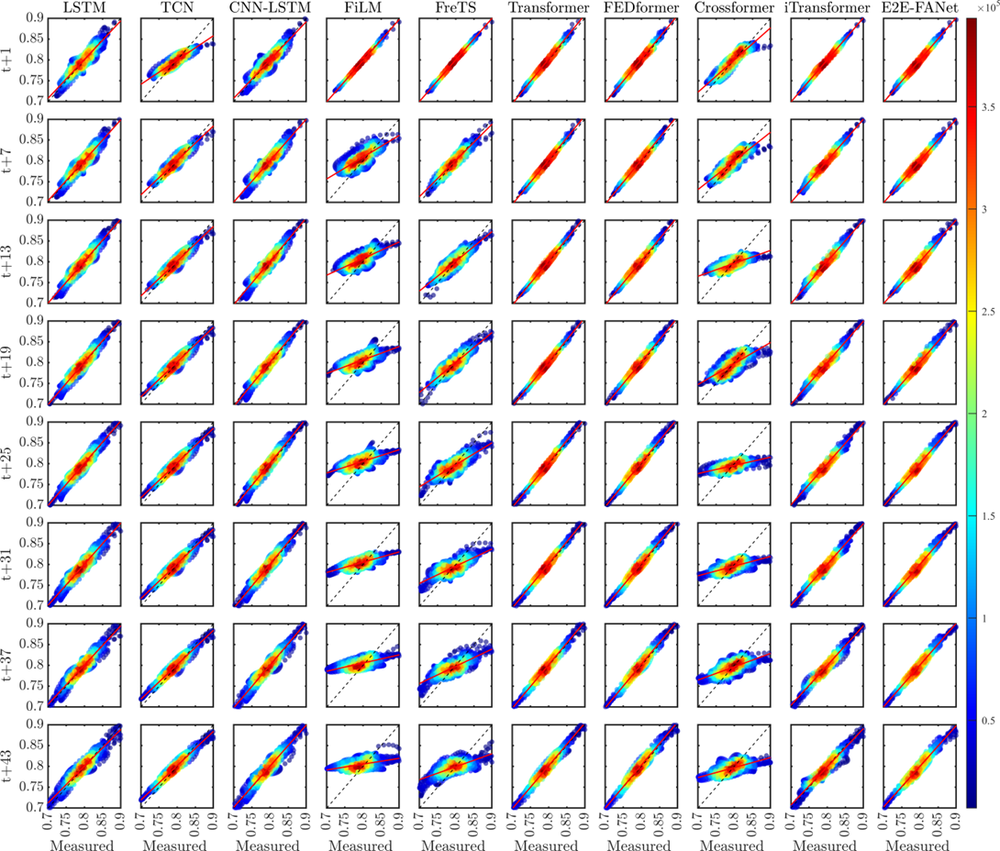

# E2E-FANet: A Highly Generalizable Framework for Waves prediction Behind Floating Breakwaters via Exogenous-to-Endogenous Variable Attention


### This project is qualified for participation in the "National Pioneer Cup on Intelligent Computing – Shandong University of Science and Technology Selection"

## Introduction

This research aims to develop a novel deep learning framework called the Exogenous-to-Endogenous Frequency-Aware Network (E2E-FANet), with the direct objective of achieving high-precision prediction of free surface elevation behind floating breakwaters. 

The core innovations of this model lie in:
1) Designing an exogenous-to-endogenous cross-attention mechanism that explicitly models the driving influence of structural motion on water surface variations by using breakwater motion as the "keys" and "values" in the attention mechanism, while treating free surface elevation as the "query," thereby overcoming the causal relationship modeling deficiencies of traditional models; 
2) Introducing a dual-basis frequency mapping module that utilizes orthogonal sine and cosine basis functions to enhance the model's capability in capturing frequency and periodicity characteristics within free surface elevation sequences.

## E2E-FANet


## Run
```bash
bash ./scripts/wave_forecast/E2EFANet.sh
```

## Result


